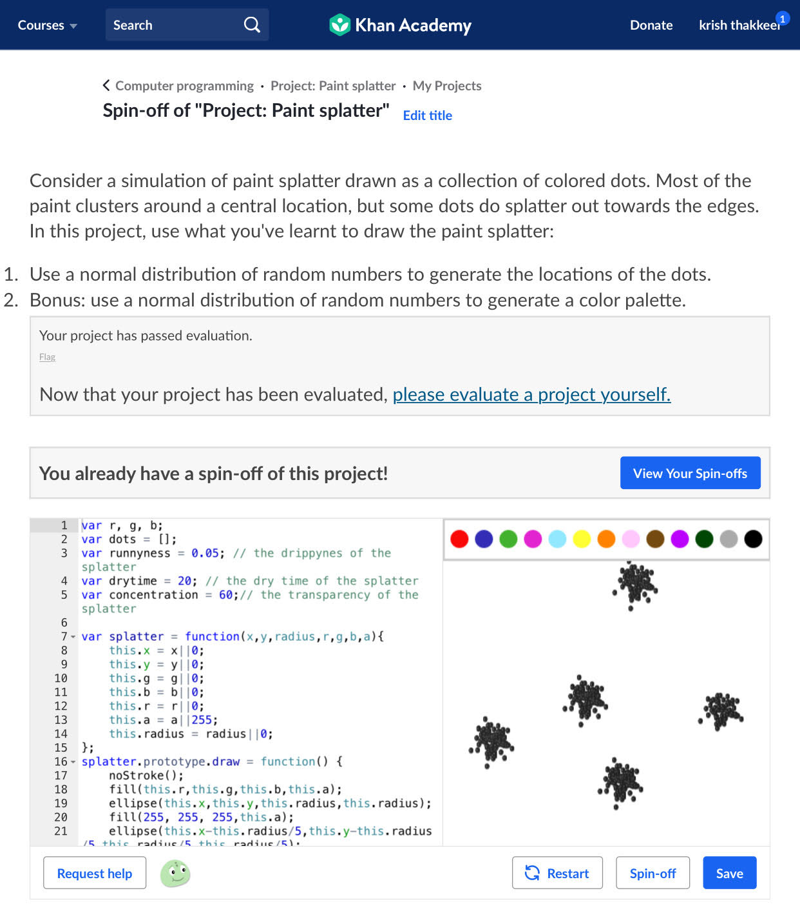
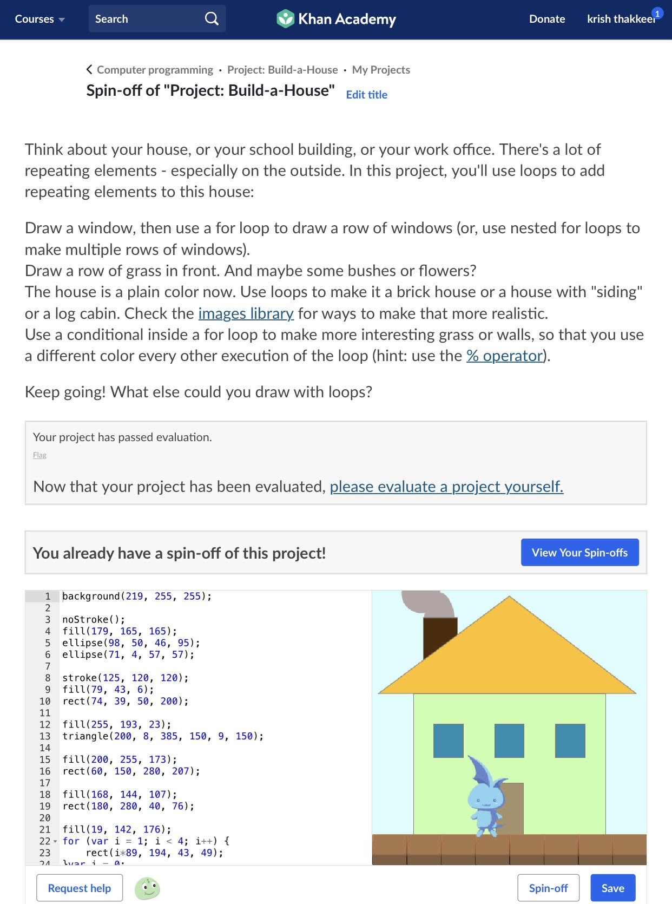
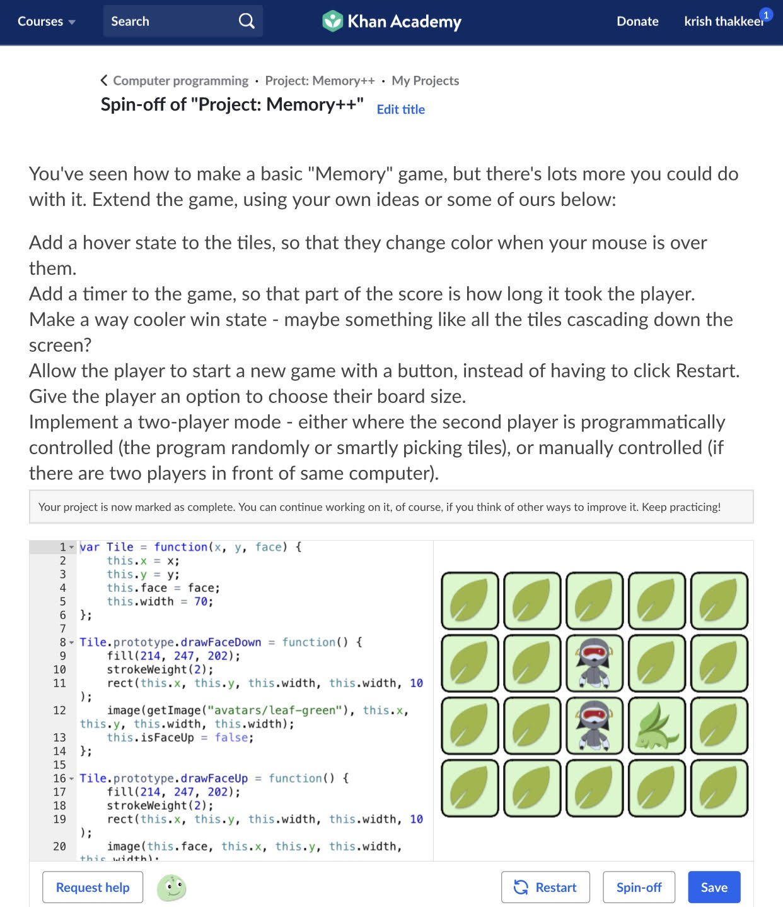
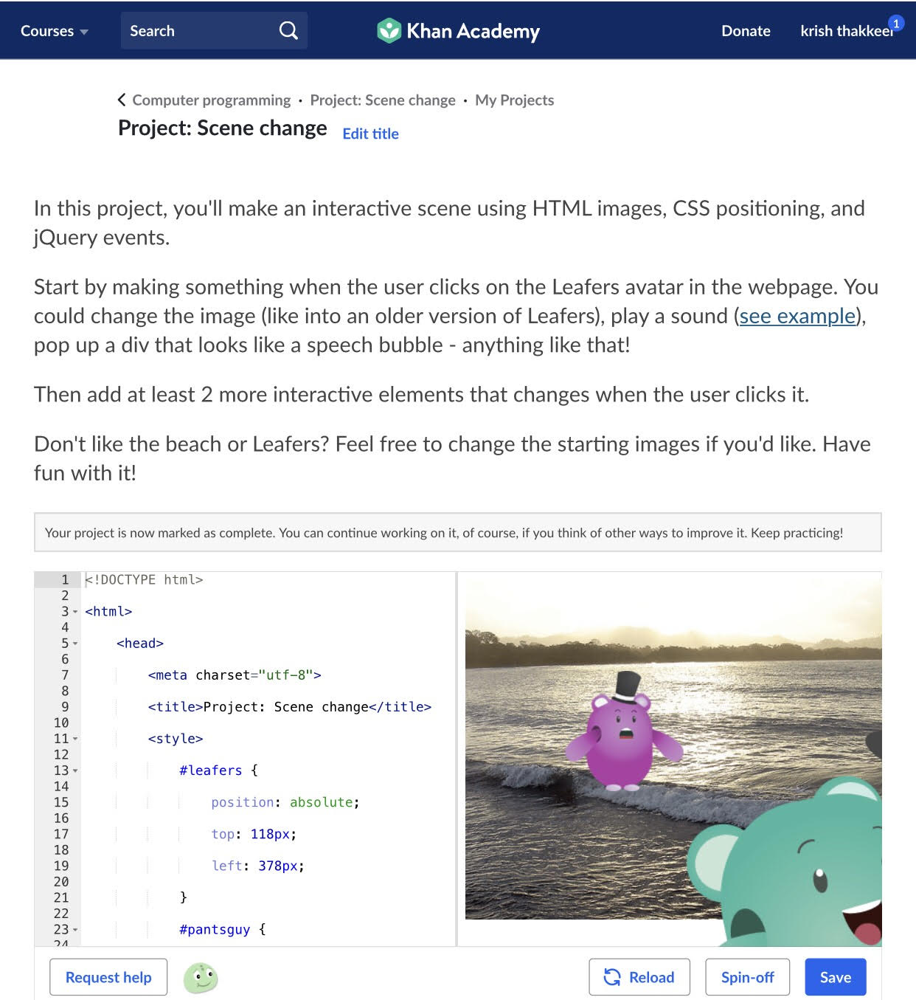

Krishs Portfolio
This portfolio contains an easy-to-customize personal portfolio.

Welcome to the Ics4U-2019,sem 2, All the modules on this have fully been completed by me. My top 10 and more modules I did in this class are:

Git hub supports the html image tag. But I chose to use the relitive pass like used in html comand line. It has to made sure that there is no space in file name because then you will need to put in a %20 for it to work. 

1. Natural simulations

Another big portion of this course was on learning Natural Simulations by Dan Shiffman on Khan Academy. Main stuff that was went through was noise vectors, oscillations and other things. The image I have right here is of the project paint splatter and I think is my best piece of work because I did not understand how to do this but then I viewed others and got inspired and used other pain splatter projects as a template of what to do then learned and did the project and I think it was done very well and more interactive than others. Even though I used others code to help me it taught me a lot and about not just doing the work but doing the work to learn and do more than is expected.  You can see the code for this project on the left. 

2. Algorithms

I have completed the entire Algorithms unit on Khan Academy, including all the challenges and projects.In this module I had learned a lot about binary search and recersian and many sorting types. This was cool to learn because in a previous computer science class I did a project on selection sort and to further understand these was very interesting and gained an interest to continue learning about it. 

3. Intro to JS: Drawing and Animation

I have also finished the Intro to JS: Drawing and Animation lesson on Khan Academy. In this I have learned a lot of different code like objects, functions and more. Here I have drawn a house according to the project given to me. Here we have many different objects together to make a image/ building of a house. 

4. Intro to HTML/CSS: Making webpages

Furthermore, I have finished the HTML/JS: Making webpages module on Khan Academy.This module is essentially used to help someone complete this webpage right here. I also found the styling aspect very intriguing and was fun to do and deal with. Text properties are also very interesting. 

5. HTML/JS: Making webpages interactive

I have also done all of the HTML/JS: Making Webpages Interactive module on Khan Academy. In this I learned to add on to the HTML making webpages. It add on by learning new parts of the webpage making process and how to make them more appealing to people and was very helpful to learn. It has already come into use because I used the html relative pass to embed photos and picture into this portfolio. 

6. Intro to SQL: Querying and managing data

In the intro to SQL: Querying and managing I have fully finished the module. I learned to use SQL to store, query, and manipulate data. In this I felt like it was linked to business and accounting from the information that was dealt with and interacted with. This may be very helpful with the business, accounting type of work. 

7. Advanced JS: Games & Visualizations

In this module Advanced JS: Games & Visualizations a lot of different techniques were taught for us to understand multi scene programs and scored games. In the photo right here we have a snippet of memory card game that I made in a project. This was a combination of most of the things that were learned. 

8. HTML/JS: Making webpages interactive with jQuery

In this fully completed module HTML/JS: Making webpages interactive with jQuery we learn a further understanding on how to make your webpage more interactive.  In the photo I have a snippet of a project were I had to take a photo put two interactive objects in the objects on the screen. So when the screen is clicked the objects move and it creates a noise. 

9. Basic Algorithm Scripting

In this completed free code camp module of algorithm scripting I got a better understanding of the technique of breaking things down into chunks and then solving in parts. This was learned by using this module. It also helps in problem solving as with the chunks of learning. 

10. Object Oriented Programming

In this completed free code camp module of Object Oriented Programming I learned further about organizing code into object definitions. These are classes and what they do is group data together. This module really help me with object oriented change in the summative and with the change I had to make to get full marks. 

11. Intermediate Algorithm Scripting

I personally find object oriented learning very interesting and would like to learn and go into further detail this summer I will definitely be incorporating computer programming and or science in the future for my own use and to help understand the language more. I comes in handy with other things, like the use of electronics and problem solving and the object oriented learning with the webpages will be very useful in the future with the way technology is used in today's day and age. It could be very useful with advertising. 
